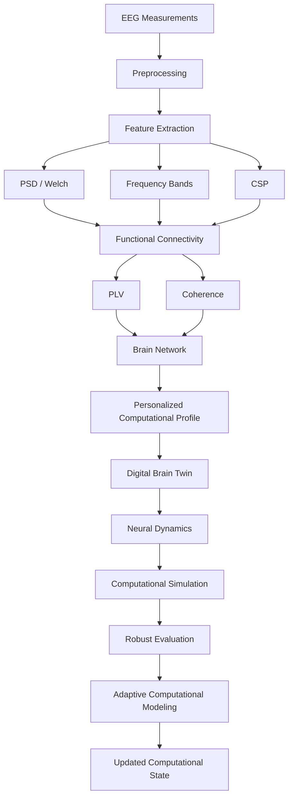

# 🧠 NeuroTwin

## An AI-Based Personalized Computational Model for Adaptive Neurorehabilitation

<p align="center">

**Model the Brain. Simulate the Future. Personalize Recovery.**

</p>

<p align="center">

<a href="https://github.com/KiarashMehrpour93/NeuroTwin">

</a>
<a href="https://www.python.org/">

</a>
<a href="https://mne.tools/">

</a>
<a href="https://scikit-learn.org/">

</a>
<a href="https://streamlit.io/">

</a>

</p>

---

## 🧠 Overview

**NeuroTwin** is a research prototype for computational neuroscience that combines EEG signal processing, machine learning, functional connectivity, brain-network analysis, neural dynamics, computational perturbation strategies, and adaptive computational modeling.

The project explores how a personalized computational representation of neural activity can be constructed from EEG-derived information and used to simulate changes in a simplified neural-dynamics model.

NeuroTwin is designed as a **computational research framework**, not as a clinical system.

---

## 🎯 Research Vision

The central idea is to create a computational representation of an individual's neural state:

```text
EEG
 │
 ▼
Signal Processing
 │
 ▼
Feature Extraction
 │
 ├── PSD
 ├── Welch Spectral Analysis
 ├── Frequency Bands
 └── CSP
 │
 ▼
Functional Connectivity
 │
 ├── PLV
 └── Coherence
 │
 ▼
Brain Network
 │
 ▼
Personalized Computational Profile
 │
 ▼
Digital Brain Twin
 │
 ▼
Neural Dynamics
 │
 ▼
Computational Simulation
 │
 ├── Strategy A
 ├── Strategy B
 └── Strategy C
 │
 ▼
Robust Evaluation
 │
 ▼
Adaptive Computational Modeling
 │
 ▼
Updated Computational State
```

---

# 🔬 Core Research Pipeline



---

# ⚙️ Main Components

| Component                  | Purpose                                               |
| -------------------------- | ----------------------------------------------------- |
| 🧠 EEG Processing          | Prepare neural recordings for computational analysis  |
| 📊 PSD                     | Analyze spectral power                                |
| 📈 Welch                   | Estimate power spectral density                       |
| 🌊 Frequency Bands         | Extract band-specific neural features                 |
| 🧩 CSP                     | Extract discriminative spatial features               |
| 🔗 PLV                     | Estimate phase-based functional connectivity          |
| 🔗 Coherence               | Estimate frequency-domain functional connectivity     |
| 🕸️ Brain Networks         | Represent functional relationships as graphs          |
| 🤖 Machine Learning        | Build computational state models                      |
| 🧬 Digital Brain Twin      | Represent an individual's computational neural state  |
| 🔄 Neural Dynamics         | Simulate evolving computational states                |
| 🧪 Perturbation Strategies | Explore hypothetical computational changes            |
| 📐 Robust Evaluation       | Measure stability and consistency                     |
| 🔁 Adaptive Modeling       | Update the computational representation               |
| 🌐 Cross-Subject Analysis  | Evaluate computational generalization across subjects |
| 🖥️ Streamlit              | Interactive research dashboard                        |

---

# 🧬 Digital Brain Twin

The Digital Brain Twin is a **computational abstraction** of neural state.

It combines:

```text
EEG Features
     +
Functional Connectivity
     +
Brain Network Metrics
     +
Baseline State
     +
Model Parameters
     ↓
Personalized Computational Profile
```

The model does **not** represent the complete biological human brain.

It is a simplified computational representation designed for experimentation and research.

---

# 🧠 Neural Dynamics

NeuroTwin uses a simplified nonlinear dynamical system:

```text
x(t+1) =
tanh(
    (1-damping) × x(t)
    +
    coupling × W × x(t)
    +
    input
)
```

Where:

| Variable   | Meaning                            |
| ---------- | ---------------------------------- |
| `x(t)`     | Current computational neural state |
| `damping`  | State decay                        |
| `coupling` | Interaction strength               |
| `W`        | Connectivity / interaction matrix  |
| `input`    | External computational input       |
| `tanh`     | Nonlinear activation               |

The system is stabilized through techniques such as:

* Row normalization
* Spectral-radius control
* State clipping
* Coupling constraints

The current implementation targets a spectral radius of approximately:

```text
ρ ≈ 0.95
```

---

# 🔗 Functional Connectivity

NeuroTwin analyzes statistical relationships between EEG channels.

Current connectivity methods include:

### Phase Locking Value

**PLV** estimates phase synchronization between signals.

### Coherence

**Coherence** estimates frequency-domain statistical relationships.

The current framework combines connectivity measures computationally:

```text
Combined Connectivity
=
0.5 × PLV
+
0.5 × Coherence
```

> Functional connectivity represents statistical relationships between signals. It should not be interpreted as direct anatomical connectivity.

---

# 🕸️ Brain Network Analysis

Connectivity matrices can be transformed into graph representations.

```text
Connectivity Matrix
        ↓
      Graph
        ↓
 ┌──────┼──────┐
 ↓      ↓      ↓
Nodes  Edges  Weights
        ↓
 Graph Metrics
```

Current network metrics include:

* Degree
* Strength
* Clustering coefficient
* Betweenness centrality
* Density
* Mean degree
* Mean strength
* Mean clustering
* Mean betweenness

Network analysis allows NeuroTwin to represent neural relationships as a computational graph.

---

# 🤖 Machine Learning

## Baseline Model

The baseline pipeline uses:

```text
StandardScaler
      ↓
Logistic Regression
```

Configuration:

```text
max_iter = 2000
class_weight = balanced
```

### Baseline Results

| Metric           |              Result |
| ---------------- | ------------------: |
| Accuracy         |          **0.5000** |
| Confusion Matrix | `[[27,20],[25,18]]` |

---

# 🧩 CSP + LDA

A second experimental pipeline combines:

```text
EEG
 ↓
CSP
 ↓
LDA
 ↓
Classification
```

Current experimental results:

| Metric   |       Mean |
| -------- | ---------: |
| Accuracy | **0.5356** |
| F1 Score | **0.4769** |

Confusion matrix:

```text
[[125, 105],
 [104, 116]]
```

These results are reported as research-prototype experiments and should not be interpreted as clinical performance.

---

# 🧪 Computational Perturbation Strategies

NeuroTwin evaluates three hypothetical computational strategies.

They are **not medical treatments**.

| Metric               | Strategy A | Strategy B | Strategy C |
| -------------------- | ---------: | ---------: | ---------: |
| Similarity           |     0.9260 |     0.9356 | **0.9572** |
| Stability            |     0.9858 |     0.9878 | **0.9920** |
| Feature Shift        |     0.0048 |     0.0041 | **0.0027** |
| Response Std         |     0.0006 |     0.0005 |     0.0016 |
| CI95                 |     0.0002 |     0.0001 |     0.0004 |
| Pattern Preservation |     0.9930 |     0.9949 | **0.9984** |
| Compatibility        |     0.9456 |     0.9529 | **0.9690** |
| Consistency          |     0.9994 | **0.9995** |     0.9984 |
| Uncertainty          |     0.0006 |     0.0005 |     0.0016 |
| Adaptation Potential |     0.9779 |     0.9809 | **0.9866** |
| Adjusted             |     0.9453 |     0.9527 | **0.9683** |

Under the current computational model, **Strategy C produces the highest overall computational score**.

This does **not** mean that Strategy C is a superior medical treatment.

---

# 🔄 Multi-Stage Simulation

NeuroTwin supports multi-stage computational simulations:

```text
Stage 1
   ↓
State 1
   ↓
Stage 2
   ↓
State 2
   ↓
Stage 3
   ↓
State 3
   ↓
...
   ↓
Final Computational State
```

A model-selected computational strategy can be evaluated at each stage.

---

# 🎲 Multi-Seed Robustness

To reduce dependence on a single random initialization, NeuroTwin supports multiple experiment seeds.

Current configuration:

```text
Seeds: 1 → 10
```

The framework evaluates:

* Mean
* Standard deviation
* Minimum
* Maximum
* 95% confidence interval
* Consistency
* Uncertainty

This helps evaluate whether computational results remain stable across repeated experiments.

---

# 📐 Sensitivity Analysis

NeuroTwin supports computational sensitivity analysis across different perturbation intensities.

Example:

```text
0.1
0.2
0.3
0.4
0.5
0.6
0.7
0.8
0.9
1.0
```

This allows the system to investigate how model outputs change when computational parameters are varied.

---

# 🔁 Adaptive Computational Modeling

The adaptive loop is:

```text
Initial Computational Profile
            ↓
       Simulation
            ↓
 Computational Response
            ↓
      Profile Update
            ↓
      Updated State
            ↓
     Next Simulation
```

The current adaptive update uses **computationally generated information**, not real post-intervention EEG measurements.

Future versions can incorporate longitudinal real-world measurements.

---

# 🌐 Cross-Subject Computational Generalization

NeuroTwin evaluates computational behavior across multiple subjects.

Current experimental configuration:

```text
Subjects: 10
EDF files: 30
Runs:
    R04
    R08
    R12
```

This is referred to as:

> **Cross-Subject Computational Generalization**

It should not be interpreted as clinical generalization.

---

# 🧠 Brain State Representation

The system creates a personalized computational profile from multiple information sources:

```text
┌─────────────────────────────┐
│      EEG Information        │
├─────────────────────────────┤
│ Spectral Features           │
│ CSP Features                │
│ Connectivity                │
│ Network Metrics             │
│ Baseline State              │
│ Model Parameters            │
└──────────────┬──────────────┘
               ↓
     Personalized Profile
               ↓
        Digital Brain Twin
```

---

# 📊 Current Research Status

| Capability                                 | Status |
| ------------------------------------------ | :----: |
| EEG Processing                             |    ✅   |
| EEG Feature Extraction                     |    ✅   |
| PSD Analysis                               |    ✅   |
| Welch Spectral Estimation                  |    ✅   |
| Frequency Bands                            |    ✅   |
| Logistic Regression Baseline               |    ✅   |
| CSP                                        |    ✅   |
| LDA                                        |    ✅   |
| Functional Connectivity                    |    ✅   |
| PLV                                        |    ✅   |
| Coherence                                  |    ✅   |
| Brain Networks                             |    ✅   |
| Graph Metrics                              |    ✅   |
| Personalized Computational Profile         |    ✅   |
| Digital Brain Twin Abstraction             |    ✅   |
| Neural Dynamics                            |    ✅   |
| Stability Control                          |    ✅   |
| Computational Perturbation Strategies      |    ✅   |
| Multi-Stage Simulation                     |    ✅   |
| Multi-Seed Robustness                      |    ✅   |
| Sensitivity Analysis                       |    ✅   |
| Adaptive Computational Modeling            |    ✅   |
| Cross-Subject Computational Generalization |    ✅   |
| Streamlit Dashboard                        |    ✅   |
| Longitudinal Real Intervention Data        |    ❌   |
| Clinical Validation                        |    ❌   |
| Clinical Trial Validation                  |    ❌   |
| Regulatory Validation                      |    ❌   |
| Full Biological Brain Simulation           |    ❌   |

---

# 📁 Project Structure

```text
NeuroTwin/
│
├── app.py
├── README.md
├── requirements.txt
├── .gitignore
│
├── data/
│   └── README.md
│
├── models/
│   └── baseline_model.joblib
│
├── results/
│   ├── metrics.json
│   ├── v2_metrics.json
│   ├── connectivity/
│   └── generalization/
│
└── src/
    ├── __init__.py
    ├── adaptive_model.py
    ├── csp_features.py
    ├── download_data.py
    ├── evaluation.py
    ├── features.py
    ├── neurotwin.py
    ├── preprocessing.py
    └── train.py
```

---

# 🛠️ Technology Stack

<p align="center">


</p>

---

# 📚 Dataset

NeuroTwin uses the:

**PhysioNet EEG Motor Movement/Imagery Database (EEGMMIDB)**

Dataset:

```text
PhysioNet EEGMMIDB
```

Raw EEG files are not included in this repository.

Dataset source:

https://physionet.org/content/eegmmidb/1.0.0/

The project excludes large raw EEG formats such as:

```text
.edf
.fif
.bdf
.set
.cnt
```

---

# ⚙️ Installation

Clone the repository:

```bash
git clone https://github.com/KiarashMehrpour93/NeuroTwin.git
cd NeuroTwin
```

Install dependencies:

```bash
pip install -r requirements.txt
```

---

# ▶️ Run the Dashboard

Launch the Streamlit research dashboard:

```bash
streamlit run app.py --server.port 7654
```

Then open the local Streamlit address shown in your terminal.

---

# 🧪 Train the Model

Run:

```bash
python src/train.py
```

---

# 🎛️ Dashboard Controls

The research dashboard supports configurable parameters including:

| Parameter              | Range     |
| ---------------------- | --------- |
| Subject ID             | 1–10      |
| Stages                 | 1–7       |
| Repetitions            | 10–100    |
| Experiment Seeds       | 1–10      |
| Main Seed              | 42        |
| Intensity              | 0.1–1.0   |
| Connectivity Threshold | 0.05–0.90 |
| Neural Dynamics Steps  | 20–300    |
| Coupling               | 0.01–0.50 |

---

# 🚀 Roadmap

```text
CURRENT
   │
   ▼
EEG + ML + Connectivity
   │
   ▼
Brain Networks
   │
   ▼
Digital Brain Twin
   │
   ▼
Dynamic Connectivity
   │
   ▼
Graph Neural Networks
   │
   ▼
Temporal Models
   │
   ▼
Longitudinal Personalization
   │
   ▼
Real Intervention Data
   │
   ▼
Independent Validation
   │
   ▼
Clinical Research
```

---

# 🔭 Future Research

Potential future directions include:

* Dynamic functional connectivity
* Directed connectivity
* Graph Neural Networks
* Temporal Transformers
* Neural ODEs
* Bayesian personalization
* Longitudinal modeling
* Multimodal neural data
* Structural brain information
* Real post-intervention EEG
* Advanced uncertainty quantification
* Larger datasets
* External validation

---

# 🔐 Privacy & Data Governance

Future versions involving clinical or longitudinal datasets would require appropriate:

* Data anonymization
* Privacy protection
* Secure storage
* Access control
* Ethical review
* Data governance

---

# ⚠️ Scientific Disclaimer

NeuroTwin is a **research prototype for computational neuroscience and artificial intelligence**.

It is **not**:

* A medical device
* A diagnostic system
* A treatment system
* A rehabilitation prescription system
* A clinical decision-support system
* A clinically validated system

The computational perturbation strategies are hypothetical simulations.

Model-selected strategies are **not clinical recommendations**.

Functional connectivity represents statistical relationships between signals and does not by itself establish anatomical or causal connectivity.

The Digital Brain Twin is a simplified computational abstraction and does not represent a complete biological simulation of the human brain.

Clinical use would require appropriate longitudinal, independent, prospective clinical research and regulatory processes.

---

# 📖 Citation

If you reference NeuroTwin in academic work:

```text
Mehrpour, K. (2026).
NeuroTwin: An AI-Based Personalized Computational Model
for Adaptive Neurorehabilitation.
GitHub Research Project.
```

---

# 👨‍💻 Author

**Kiarash Mehrpour**

GitHub:

https://github.com/KiarashMehrpour93

Portfolio:

https://kiarash-1393.github.io/kiacoder/

---

# 📜 License & Copyright

Copyright © 2026 **Kiarash Mehrpour**. All Rights Reserved.

The source code is publicly available for viewing and research evaluation purposes only.

Permission is not granted to:

* Copy the source code or substantial portions of it
* Modify or create derivative works
* Redistribute or republish the source code
* Use substantial portions in another project
* Sell, sublicense, or commercially exploit the source code
* Create a competing software product using the source code
* Mirror or redistribute substantial portions of the repository
* Present the original source code as one's own work

Academic researchers, students, reviewers, and educational users may view and reference this repository for research and evaluation purposes.

Academic citation does not grant permission to copy, modify, redistribute, or commercially use the source code.

Written permission from the copyright holder is required for uses beyond viewing, evaluation, and citation.

Third-party libraries, frameworks, datasets, models, and external components remain subject to their respective licenses and terms.

---

# 🧠 Final Vision

```text
                    HUMAN BRAIN
                         │
                        EEG
                         │
                         ▼
                Neural Measurements
                         │
                         ▼
                Computational Model
                         │
                         ▼
                  DIGITAL TWIN
                         │
                         ▼
                  Neural Dynamics
                         │
                         ▼
               Computational Simulation
                         │
             ┌───────────┼───────────┐
             ▼           ▼           ▼
         Strategy A  Strategy B  Strategy C
             │           │           │
             └───────────┼───────────┘
                         ▼
                 Robust Evaluation
                         │
                         ▼
                 Adaptive Modeling
                         │
                         ▼
             Updated Computational State
```

<p align="center">

## 🧠 Model the Brain. Simulate the Future. Personalize Recovery.

**NeuroTwin 3.0 — Research Prototype — 2026**

</p>
